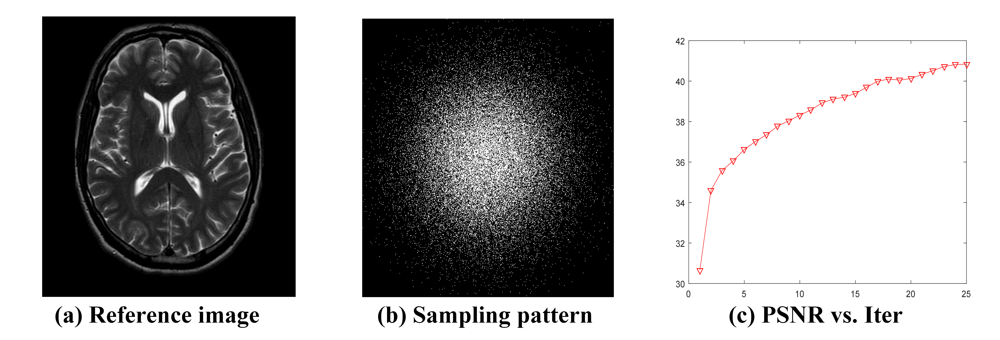
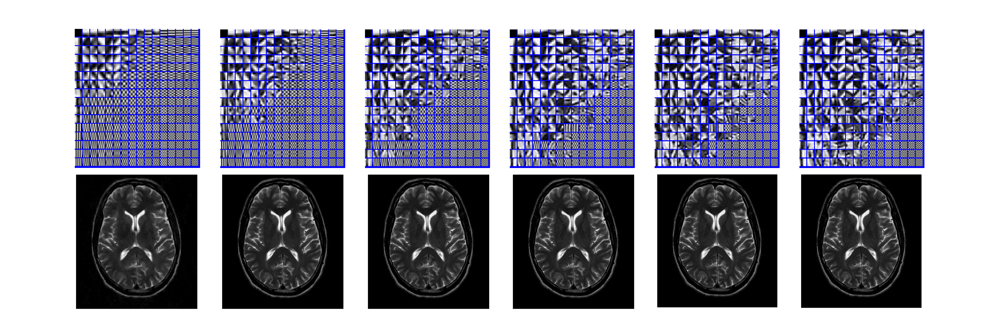

# TBMDU
Highly undersampled magnetic resonance image reconstruction using two-level Bregman method with dictionary updating

% The Code is created based on the method described in the following paper:       
%	Q. Liu, K. Yang, J. Luo, Y. Zhu, D. Liang. Highly undersampled magnetic resonance image reconstruction using two-level       
% Bregman method with dictionary updating, IEEE Trans. Med. Imag., 32 (7): 1290-1301, 2013.   
% Date : 06/7/2013    
% Version : 1.0     
% The code and the algorithm are for non-comercial use only.     
% Copyright 2013, Department of Electronic Information Engineering, Nanchang University.     
% The current version is not optimized.     

## Demo of TBMDU
  

## Display of Intermediate Results
  
From Top to Bottom：updated dictionary; reconstructed result. 

## Other Related Projects
  * Predual dictionary learning (PDL) / augmented Lagrangian multi-scale dictionary learning(ALM-DL) [**[Paper]**](http://www.escience.cn/people/liuqiegen/index.html;jsessionid=5E20FEE3694E8BB3249B64202A8E25C8-n1)   [**[Code]**](https://github.com/yqx7150/PDL_ALM_DL_code) 

  * Adaptive dictionary learning in sparse gradient domain for image recovery [**[Paper]**](https://ieeexplore.ieee.org/document/6578193/)   [**[Code]**](https://github.com/yqx7150/GradDL) 
  
  * Convolutional Sparse Coding in Gradient Domain for MRI Reconstruction [**[Paper]**](http://html.rhhz.net/ZDHXBZWB/html/2017-10-1841.htm)   [**[Code]**](https://github.com/yqx7150/GradCSC)
    
  * Field-of-Experts Filters Guided Tensor Completion [**[Paper]**](https://ieeexplore.ieee.org/document/8291751/similar#similar)   [**[Code]**](https://github.com/yqx7150/FoE_STDC)   [**[Slide]**](https://github.com/yqx7150/EDAEPRec/tree/master/Slide)
  
  * Synthesis-analysis deconvolutional network for compressed sensing [**[Paper]**](https://ieeexplore.ieee.org/document/8296620)   [**[Code]**](https://github.com/yqx7150/SADN)

